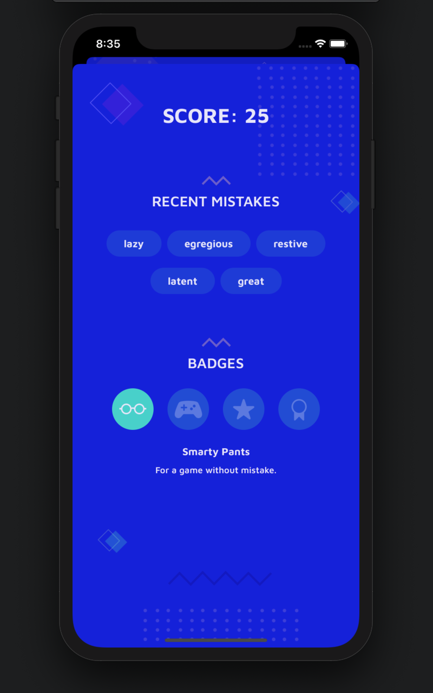

# Synonymist
> App to improve a vocabulary with Advanced English words
>
> Intended for users with Upper-Intermediate level of English language. Database contains more than 100 English words. 
>
> Written in SwiftUI.

 

### Fuctionality of the App
1. Allows to choose the most suitable synonyms in the game form
2. Collects and saves user's results of the game 
3. Allows to user to see a hint for each question
4. Provides the recent mistakes made by user
5. Lets user to earn badges during the game

 

### Screenshots

*Main View of the Game*

 

*User's results of the game*

 

### Features 
- UserDefaults for reading and writing data
- JSON-file with data 
- Feedback for user's actions with haptics (UINotificationFeedbackGenerator) and animation
- Gamification (badges, score, alerts)  

 
---

### Communication
If you found a bug or want to discuss a new feature, feel free to [reach out](mailto:Valerika.Hello@gmail.com).

 

### Credits

I highly recommend [Merriam-Webster](https://www.merriam-webster.com). The dictionary has up-to-date words, explanations, and etymologies. Also on the website you can find games, common mistakes and examples. Sometimes I like to spend time just browsing 😄 Merriam-Webster website allows to display, reproduce, print or download their content for personal, non-commercial use.

Also I have used information from [Wiktionary](https://en.wiktionary.org/wiki). An internet resource that is treated with special favor by a lot of people including me. It allows users to share, reuse, edit and [etc.](https://foundation.wikimedia.org/wiki/Terms_of_Use/en) articles.
